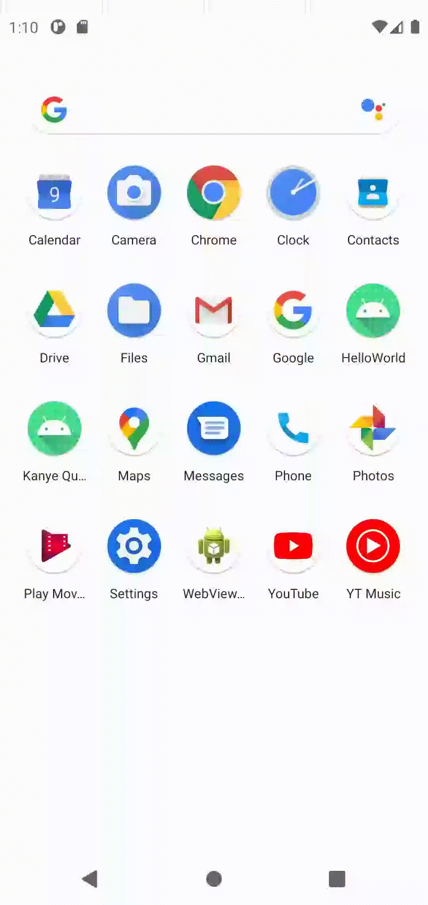

# KanyeQuote
An Android app that consumes <a href="https://api.kanye.rest/">Kanye Rest API</a>

# Required Tech

Android Studio

# Setup & Launch

* Open project in Android Studio and run!

# Credits

* <a href="https://github.com/ajzbc/kanye.rest">kanye.rest</a>
* <a href="https://developer.android.com/training/volley">Volley Documentation</a>
* <a href="https://www.youtube.com/watch?v=DpEg_UVkv6E">yrrhelp: How to Call REST API in Android</a>

# Got Questions? Contact me!
efim@shulginmusic.com
